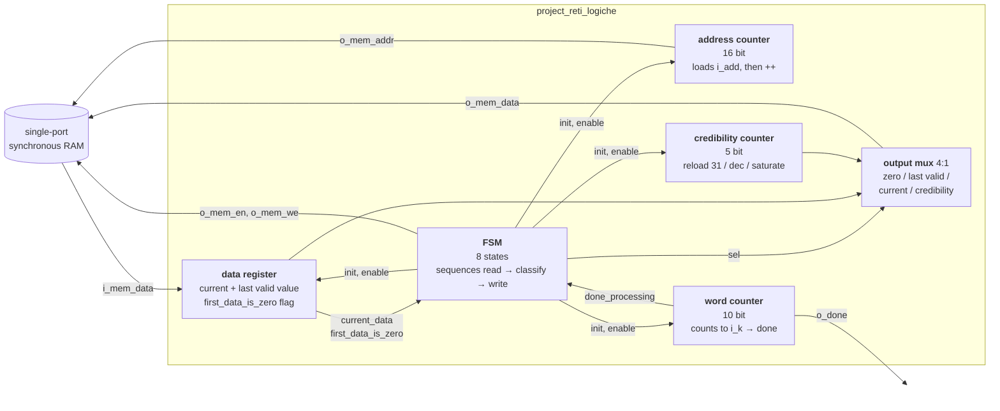
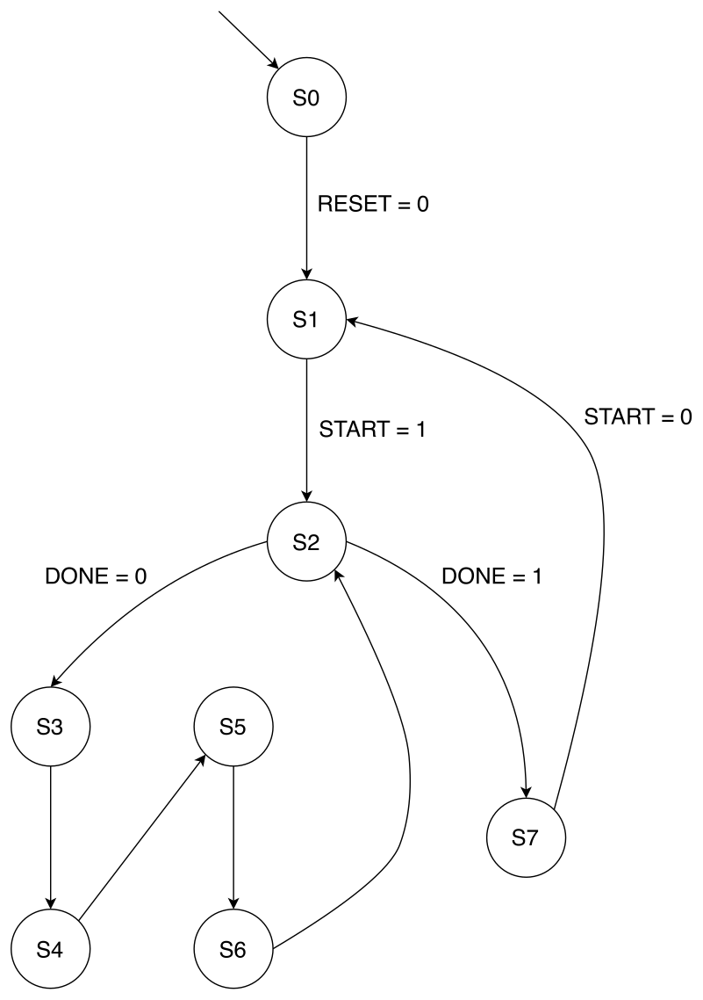

# VHDL Memory-Interface FSM — sequence gap filler with credibility tagging

[](https://github.com/emanueleminotti/vhdl-memory-interface-fsm/actions/workflows/ci.yml)


A synthesisable VHDL module that walks a byte-addressable RAM region, replaces
every missing sample with the most recent valid one, and tags each sample with a
**credibility** score describing how stale it is — all in hardware, over a
single-port RAM interface, with no CPU in the loop.

**The problem.** Sampled data streams arrive with holes: a sensor drops a
reading, a channel loses a frame, and a zero lands in the buffer. A consumer
downstream needs a gap-free stream, but it also needs to know which samples are
real and which are extrapolated. Doing this fix-up in software costs a memory
round trip per sample and an interrupt budget. This module does it in place at
memory bandwidth, and encodes the "how much should I trust this?" answer next to
every value, so the consumer gets both the data and its confidence for free.

## How it works

The RAM region is laid out as interleaved `(value, credibility)` byte pairs.
The producer writes only the value cells; the module fills in the rest:

| Input value | Value written back | Credibility written back |
| --- | --- | --- |
| non-zero | unchanged | `31` (freshly measured) |
| zero, after a valid sample | last valid value | previous credibility − 1, saturating at 0 |
| zero, before any valid sample | `0` | `0` (nothing to extrapolate from yet) |

A credibility of 31 means "this is a real measurement"; 30 down to 1 means "this
is the *n*-th consecutive extrapolation"; 0 means "stale beyond usefulness".

### Worked example

Sequence of `K = 14` values starting at address `1234`. Only the even cells are
populated on input; the module fills in everything shown in bold.

| Offset | 0 | 1 | 2 | 3 | 4 | 5 | 6 | 7 | 8 | 9 | 10 | 11 | 12 | 13 |
| --- | --- | --- | --- | --- | --- | --- | --- | --- | --- | --- | --- | --- | --- | --- |
| value in | 128 | 64 | 0 | 0 | 0 | 0 | 0 | 100 | 1 | 0 | 5 | 23 | 200 | 0 |
| value out | 128 | 64 | **64** | **64** | **64** | **64** | **64** | 100 | 1 | **1** | 5 | 23 | 200 | **200** |
| credibility out | **31** | **31** | **30** | **29** | **28** | **27** | **26** | **31** | **31** | **30** | **31** | **31** | **31** | **30** |

The run of five zeros after `64` walks the credibility down 31 → 26 while
holding the value at 64. Each new valid sample (`100`, `1`, `5`, `23`, `200`)
snaps it back to 31.

## Features

- **In-place streaming fix-up** — reads and rewrites the sequence through a
  single-port synchronous RAM interface, 5 clock cycles per `(value,
  credibility)` pair, with no buffering of the sequence.
- **Saturating credibility counter** — 5-bit staleness score per sample,
  clamped at 0 so a long gap can never wrap around.
- **Restartable without reset** — raise `i_start`, wait for `o_done`, lower
  `i_start`, and the module is immediately ready for the next region. Every
  counter is re-initialised from the setup state, not from a global reset.
- **Asynchronous reset that is honoured mid-run** — an in-flight sequence is
  abandoned cleanly and `o_done` stays low.
- **Covers the whole parameter range** — sequence length `K` up to 1023 (the
  full range of the 10-bit `i_k`) anywhere in a 64 KiB address space; the
  regression suite exercises up to `K = 1022`.
- **Latch-free and timing-clean** — 63 LUTs, 57 flip-flops, 0 latches, with
  17.4 ns of slack at a 20 ns clock period on Artix-7.
- **21-testbench regression suite** run by a single `make test`, with CI.

## Tech stack

| | |
| --- | --- |
| Language | VHDL (analysed as VHDL-2008; the RTL itself is VHDL-93 compatible) |
| Simulator | [GHDL](https://github.com/ghdl/ghdl) — free and used by the CI |
| Synthesis | Xilinx Vivado, target Artix-7 `xc7a200tfbg484-1` |
| Waveforms | GTKWave (`.ghw` dumps via `make wave`) |
| Build | GNU Make |
| CI | GitHub Actions |
| Report | LaTeX |

## Getting started

Install GHDL:

```bash
sudo apt install ghdl          # Debian / Ubuntu
brew install ghdl              # macOS
# Windows: MSYS2 (pacman -S mingw-w64-ucrt-x86_64-ghdl-mcode) or a release from
# https://github.com/ghdl/ghdl/releases
```

Clone and run the whole suite:

```bash
git clone https://github.com/emanueleminotti/vhdl-memory-interface-fsm.git
cd vhdl-memory-interface-fsm
make test
```

`make test` analyses the RTL plus every testbench and reports one line per test:

```
  tb_async_reset_recovery    pass
  tb_consecutive_runs        pass
  tb_empty_sequence          pass
  ...
  tb_single_run_09           pass

  21 passed, 0 failed
```

### Other targets

```bash
make list                          # show every available testbench
make test TB=tb_empty_sequence     # run a single testbench
make wave TB=tb_single_run_01      # run one test and dump build/<TB>.ghw
gtkwave build/tb_single_run_01.ghw # inspect the waveform
make syntax                        # syntax-only check, no elaboration
make clean                         # remove build/
```

## Using the module

Instantiate `project_reti_logiche` between your control logic and a single-port
synchronous RAM:

```vhdl
uut : entity work.project_reti_logiche
    port map (
        i_clk   => clk,
        i_rst   => rst,        -- asynchronous
        i_start => start,
        i_add   => base_addr,  -- 16 bit: first value cell of the region
        i_k     => seq_len,    -- 10 bit: number of values (0..1023)
        o_done  => done,
        -- RAM interface
        o_mem_addr => mem_addr,
        i_mem_data => mem_rdata,
        o_mem_data => mem_wdata,
        o_mem_we   => mem_we,
        o_mem_en   => mem_en
    );
```

Driving one run:

```vhdl
-- The region to process: K values at base_addr, interleaved with their
-- credibility cells, so it spans 2*K bytes.
base_addr <= std_logic_vector(to_unsigned(1234, 16));
seq_len   <= std_logic_vector(to_unsigned(14, 10));

start <= '1';                        -- request the run
wait until done = '1';               -- ~5 cycles per value
start <= '0';                        -- release; done falls, ready for the next run
```

The module owns the RAM only between `i_start` and `o_done`: it drives
`o_mem_en` low in the idle and done states, so the bus can be shared with
whatever filled the buffer in the first place.

## Architecture

The design is split into five datapath modules driven by one control FSM, each
implemented as a separate VHDL process. Keeping the counters independent of the
control flow is what makes the "restart without reset" behaviour cheap: the FSM
re-initialises them from its setup state instead of relying on `i_rst`.



### Control FSM

<p align="center">
  
</p>

| State | Role |
| --- | --- |
| `S0` | Reset state. Memory disabled. |
| `S1` | Setup: re-initialise every counter and register, wait for `i_start`. |
| `S2` | Loop head. Leaves for `S7` once `i_k` values have been processed. |
| `S3` | Wait state covering the synchronous RAM read latency. |
| `S4` | Classify the value just read, then write the value cell. |
| `S5` | Wait state. |
| `S6` | Write the credibility cell, advance the word counter. |
| `S7` | Done. Memory disabled, waits for `i_start` to be released. |

`S2`, `S3` and `S5` drive no active outputs. `S3` and `S5` exist because the RAM
is synchronous: data requested in one cycle is only valid in the next, so the
classify step in `S4` has to be one cycle behind the address issued for it. The
loop `S2 → S3 → S4 → S5 → S6 → S2` is therefore 5 clock cycles per value.

### Design decisions

- **Five cycles per value instead of two.** A tighter loop would need either a
  dual-port RAM or a registered address path to overlap the value write with the
  next read. The specification fixed a single-port interface and a 20 ns clock,
  where the simple loop already meets timing with 17.4 ns of slack — so the
  extra wait states were the right trade, and the design fits in 63 LUTs.
- **`first_data_is_zero` as a separate flag rather than a sentinel value.**
  Leading zeros have to stay zero with credibility 0, which is a different rule
  from every other zero. A flag keeps that special case out of the credibility
  counter, which stays a plain saturating down-counter.
- **Credibility decrement lives in the counter, not the FSM.** The FSM only
  raises `en_cred_count`; saturation at 0 is enforced locally. This keeps the
  saturation logic off the control path.
- **Outputs default to inactive at the top of the FSM output process.** Every
  control signal is assigned a default before the `case`, so only the states
  that need a signal drive it. This is what guarantees the synthesis result is
  latch-free.

## Repository layout

```
src/
  project_reti_logiche.vhd       the module (RTL)
tests/
  reference/                     testbench supplied with the assignment
  edge_cases/                    empty sequence, reset and start-handshake corners
  scenarios/                     single-run and multi-run functional regressions
docs/
  report/                        LaTeX sources and compiled PDF of the report
  diagrams/                      editable draw.io sources for the figures
  images/                        figures used by this README
Makefile                         GHDL simulation flow
```

### Test suite

| Group | Tests | Coverage |
| --- | --- | --- |
| `reference` | 1 | The scenario supplied with the assignment (`K=14`). |
| `edge_cases` | 6 | `K=0`; reset mid-read; reset between runs; `i_start` raised during reset; recovery after async reset; two runs back to back. |
| `scenarios` | 14 | Single runs from `K=10` to `K=64`, and multi-run sequences up to `K=1022` (the maximum) spread across the address space, including regions starting at address 1. |

Every testbench drives the DUT, models the RAM, and compares the final memory
contents against a pre-computed expected image, so a failure points at the exact
byte offset that went wrong.

## Known limitations

Two related issues found while auditing the loop-termination logic. Both leave
the contents of the declared region correct, which is why the whole suite still
passes.

- **The loop runs one iteration too many.** `word_counter` compares the
  *pre-increment* count against `i_k`:

  ```vhdl
  word_count <= std_logic_vector(unsigned(word_count) + 1);
  if (unsigned(word_count) = unsigned(i_k)) then   -- one iteration late
      done_processing <= '1';
  ```

  so `o_done` rises after `K + 1` passes and the module writes 2 bytes past the
  region, at offsets `2K` and `2K + 1`. For `K = 0` this means it performs a read
  and two writes instead of asserting `o_done` immediately.
- **The regression suite cannot see it.** Each testbench only checks offsets
  `0 .. 2K-1`, so the two extra bytes fall outside the compared window. In
  `tb_empty_sequence` the check loop is `for i in 0 to SCENARIO_LENGTH*2-1` with
  `SCENARIO_LENGTH = 0`, which is a null range in VHDL and therefore verifies
  nothing about memory contents at all.

Fixing it means comparing the post-increment count, and driving `o_done` from
the FSM reaching `S7` so that `K = 0` can short-circuit out of `S2` without a
memory access. A guard testbench that pre-fills the bytes around the region with
a sentinel and asserts they are untouched would keep it from regressing.

## Notes

- This started as the final project for *Prova Finale di Reti Logiche*
  (Politecnico di Milano, 2023/2024), by Emanuele Minotti and Filippo Morelli.
  The entity name `project_reti_logiche` and the port names are fixed by the
  assignment and are kept as-is so the supplied reference testbench still
  applies.
- [`docs/report/report.pdf`](docs/report/report.pdf) is the original academic
  report **in Italian**, and covers the synthesis and timing results in full.
  Everything in this README is self-contained in English.
- `docs/report/images/schematic.pdf` is the post-synthesis schematic produced by
  Vivado.
